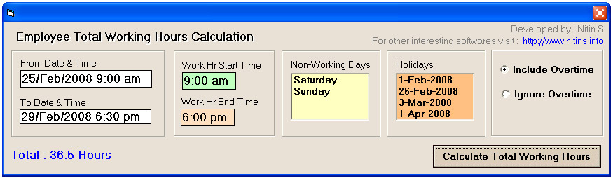

## Employee Business/Working Hours Calculation

### Description

Calculate the exact Buisness/Working Hours of an Employee between two given dates. It can Include/Exclude Overtime hours. It also excludes Holidays and Saturday/Sunday during the calculation.
 
### More Info
 
- 2 Dates i.e. From Date/time and To Date/Time

- Working Hour Start Time

- Working Hour end Time

- List of Holidays

Total Hours &amp; minutes the employee has worked between the given dates

             |
---                |---
**Submitted On**   |2008-02-08 01:48:36
**By**             |[Nitin Shinde](https://github.com/Planet-Source-Code/PSCIndex/blob/master/ByAuthor/nitin-shinde.md)
**Level**          |Advanced
**User Rating**    |4.7 (14 globes from 3 users)
**Compatibility**  |VB 6\.0
**Category**       |[Complete Applications](https://github.com/Planet-Source-Code/PSCIndex/blob/master/ByCategory/complete-applications__1-27.md)
**World**          |[Visual Basic](https://github.com/Planet-Source-Code/PSCIndex/blob/master/ByWorld/visual-basic.md)
**Archive File**   |[Employee\_B210099282008\.zip](https://github.com/Planet-Source-Code/nitin-shinde-employee-business-working-hours-calculation__1-70058/archive/master.zip)

